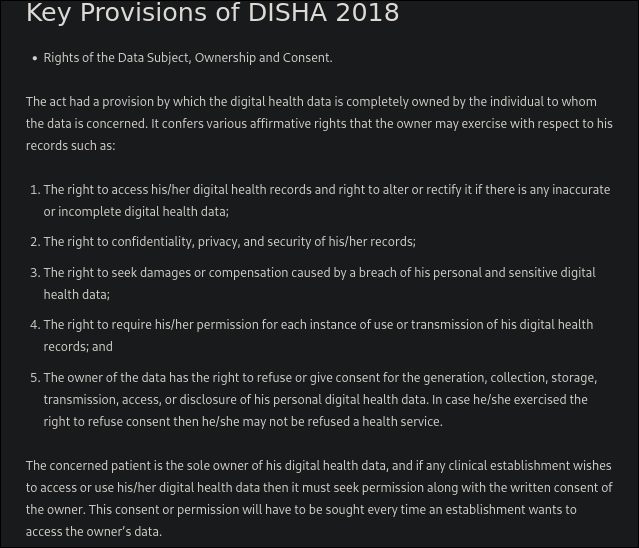
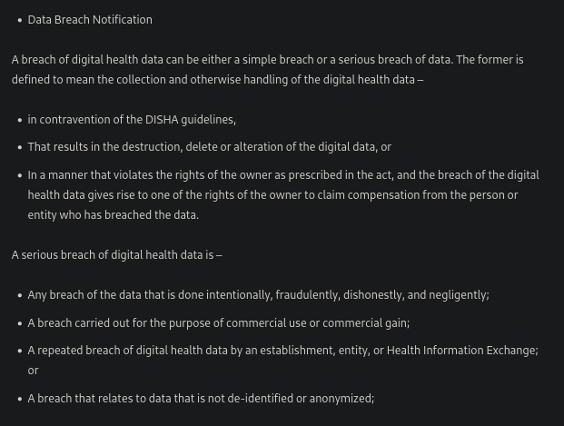

| Feature               | SDLC                     | ASPICE                      | ISO 26262                 |
| --------------------- | ------------------------ | --------------------------- | ------------------------- |
| **Focus**             | Functionality & delivery | Process quality & maturity  | Functional safety         |
| **Regulation**        | Flexible                 | Automotive industry-focused | Strictly regulated        |
| **Traceability**      | Moderate                 | Strong                      | Mandatory                 |
| **Safety Management** | Limited                  | Indirectly addressed        | Core focus                |
| **Risk Handling**     | Functional risks         | Quality/process risks       | Functional & safety risks |

needs to read about regulatory norms (DISHA and THE PERSONAL DATA PROTECTION BILL, 2018) for important requirement changes in accordance with ASPICE and ISO26262 standards.

## current functional changes under consideration->
1.  give option to users to download, migrate and permanently delete their data from our server.
2. accept privacy policy before using services
3. clear privacy policy statements for ownership, security, storing, processing of data as long as its on our servers.

## Important considerations for more req. changes from following changes.
- About [DISHA: Digital Information Security in Healthcare Act of 2018](https://blog.ipleaders.in/insight-on-digital-information-security-in-healthcare-act-2018/)
- [Personal Data Protection Bill 2018 ](https://www.meity.gov.in/writereaddata/files/Personal_Data_Protection_Bill,2018.pdf) : chapter II to chapter VIII

## functional requirement to handle data breach->

- **Audit Trails**: 
	- Maintain logs of all API requests, including timestamps and user details, for auditing purposes.
- **Compliance with User Rights**:
	- Provide mechanisms to delete user accounts and associated data upon request.
	- Allow users to review and manage their consent settings.
- **Quality management system**
	- determine criteria and methods needed to ensure that both the operation and control of these processes are effective;
	- ensure the availability of resources and info necessary to sur=pport the  operation and monitoring of these processes;
	- implement actions necessary to achieve planned results and maintain the effectiveness of these processes;
	-monitor measure as appropriate and analyse these processes.
	- establish and maintain records needed to demonstrate conformance to this International Standard establish and compliance with applicaable regulatory requirements.

	**track ->** 
	- evaluated for their impact on the quality management system;
	- evaluated for their impact on the medical devices produced under this quality management system;

### **The organization shall document procedures for the validation of the application of computer software used in the quality management system. Such software applications shall be validated prior to initial use and, as appropriate, after changes to such software or its application.**
	The specific approach and activities associated with software validation and revalidation shall be proportionate to the risk associated with the use of the software.
	maintain records.

# Documents Required
	1. documented statements of a quality policy and quality objectives.
	2. Quality manual and medical device file
	3. documented procedures and records required by International standards.
	4. Docs inc records determinedby the organisations to be necessary to ensure the effective planning operations and control of its processes
	5. other docs specifierd but applicable regulatory requirements.

## **Quality policy**
ensure that the quality:
1. includes a commitment to comply with requirements and to maintain the effectiveness of the quality management system;
2. provides a framework for establishing and reviewing quality objectives;
3. is communicated and understood.
4. is reviewed for continuing suitability.