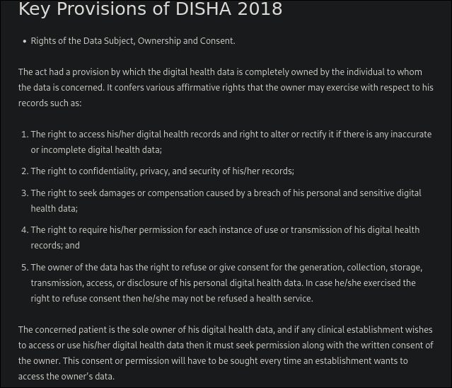

| Feature               | SDLC                     | ASPICE                      | ISO 26262                 |
| --------------------- | ------------------------ | --------------------------- | ------------------------- |
| **Focus**             | Functionality & delivery | Process quality & maturity  | Functional safety         |
| **Regulation**        | Flexible                 | Automotive industry-focused | Strictly regulated        |
| **Traceability**      | Moderate                 | Strong                      | Mandatory                 |
| **Safety Management** | Limited                  | Indirectly addressed        | Core focus                |
| **Risk Handling**     | Functional risks         | Quality/process risks       | Functional & safety risks |

needs to read about regulatory norms (DISHA and THE PERSONAL DATA PROTECTION BILL, 2018) for important requirement changes in accordance with ASPICE and ISO26262 standards.

## current functional changes under consideration->
1.  give option to users to download, migrate and permanently delete their data from our server.
2. accept privacy policy before using services
3. clear privacy policy statements for ownership, security, storing, processing of data as long as its on our servers.

## Important considerations for more req. changes from following changes.
- About [DISHA: Digital Information Security in Healthcare Act of 2018](https://blog.ipleaders.in/insight-on-digital-information-security-in-healthcare-act-2018/)
- [Personal Data Protection Bill 2018 ](https://www.meity.gov.in/writereaddata/files/Personal_Data_Protection_Bill,2018.pdf) : chapter II to chapter VIII

## functional requirement to handle data breach->
![[Pasted image 20241213170438.png]]